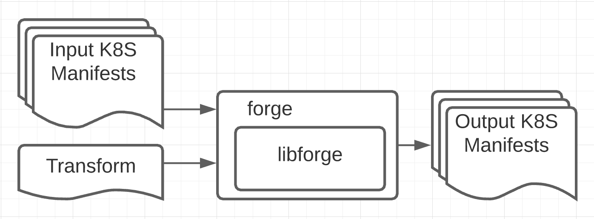

# Forge

## Problem

When serializing/deserializing Kubernetes resources, either for the purposes of
migration or DR (Backup/Recovery), it's often desirable to mutate the object
between export and import. This would typically be done to manipulate data
that is going to be environment specific. Some examples:

* node selectors/taints on namespaces and pods
* resource quotas
* labels and/or annotations

### libforge

Golang library with a suite of utilities for executing the above transforms.
Accepts set of input k8s manifests (kubernetes resources), and runs a set of
transforms against them to output manifests, ready to be either persisted
or imported into a target cluster.

#### Design <TODO>

Matcher:
-> GVKN - GroupVersionKindName, could regex on them to match?

Expression: Formatting? JSONNET? Other format? How should the transforms be expressed?

What does the data struct look like?

#### Possible Consumers

* **forge**: Thin cli wrapper around `libforge` to read input and exercise lib.

Accept transform yaml with set of transforms?

`forge -i manifest-in/ -t transform.yml -o manifest-out/`

Accept transform str directly? (cli provided mutation?)

`forge -i manifest-in/ -m '.infield/.outfield=x' -o manifest-out/`

* **MTC**: Baked into a runner image (could be generally useful), or vendor and
bind directly to the lib to run transforms?

* **OADP?**: Baked into a runner image (could be generally useful), or vendor and
bind directly to the lib to run transforms? Could be useful in the context of
DR.

* **move2kube**: k8s -> m2k -> k8s, again, can bind to libforge and use the fn
directly.
